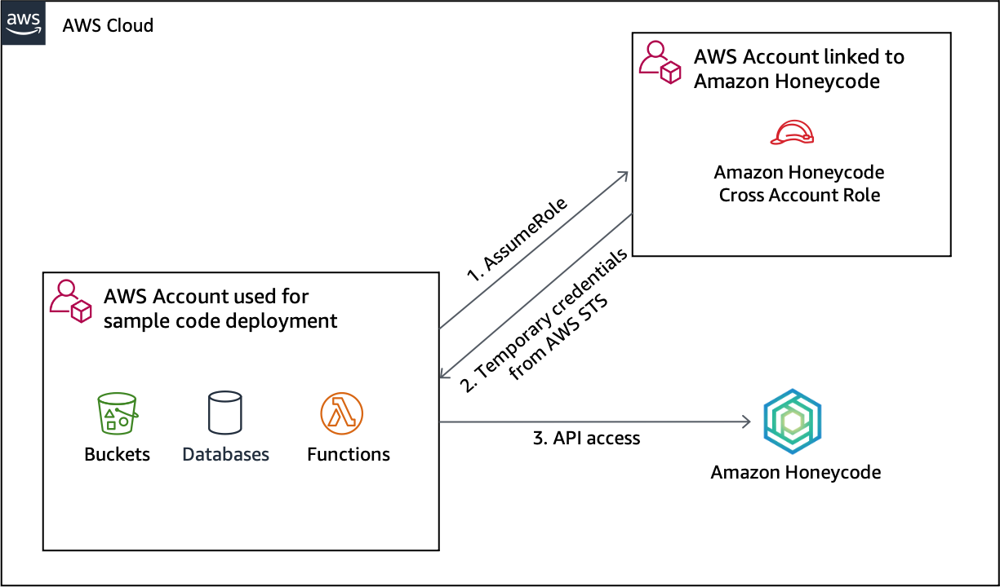

## Accessing a Honeycode workbook from a different AWS account

You can setup a cross account IAM role to allow access to your Honeycode workbooks for Lambda functions that are deployed in a different, trusted account. Here is an overview of how the sample code will use the cross account role to access your Honeycode workbook:



The steps to follow are:

1. Open the AWS console and login to the account where you are planning to deploy your Lambda functions/sample code
2. Copy the 12 digit AWS account id for this account 
3. Logout from this account 
4. Login to the AWS account that is connected with your Honeycode team
5. Open the AWS IAM console
6. Click on *Policies* and then click on *Create policy*
7. Click on the *JSON* tab and copy and paste the following policy
```
{
    "Version": "2012-10-17",
    "Statement": [
        {
            "Sid": "HoneycodeWorkbookAccess",
            "Effect": "Allow",
            "Action": "honeycode:*",
            "Resource": [
                "arn:aws:honeycode:*:*:workbook:workbook/YOUR_WORKBOOK_ID",
                "arn:aws:honeycode:*:*:table:workbook/YOUR_WORKBOOK_ID/table/*"
            ]
        }
    ]
}
```
8. Replace YOUR_WORKBOOK_ID with the Workbook ID that you copied from your Honeycode App  
9. Enter a name such as *MyHoneycodeWorkbookLambdaPolicy* for this policy. 
10. Click on Create Policy
11. Click on *Roles* and click on *Create role*
12. Select *Another AWS account* and enter the account id that you copied in step 2
13. Click on *Next:Permissions*
14. Search for and select the policy that you created in step 9. In this guide we have used the name *MyHoneycodeWorkbookLambdaPolicy* for the policy
> Note: You can also use the managed policy *AmazonHoneycodeWorkbookFullAccess* instead of creating your own custom policy (steps 6 to 10)if you want to give access to all workbooks in your Honeycode team
15. Click on *Next:Tags* and then *Next:Review*
16. Enter a Role name such as *MyHoneycodeWorkbookLambdaRole* and click on *Create role*
17. You should see a message that says *The role MyHoneycodeWorkbookLambdaRole* has been created. Click on the role name in this message to open the role
18. Copy the Role ARN. This should in the format `arn:aws:iam::123456789012:role/MyHoneycodeWorkbookLambdaRole`. You will be using this value to update *crossAcountHoneycodeRoleArn* in *env.json* file in your Honeycode Table API sample code with this value 
19. Logout of this AWS account 
20. Login back to the account where you will be deploying your sample code including Lamdba using Cloud9 and continue with the rest of the instructions to complete the deployment.
